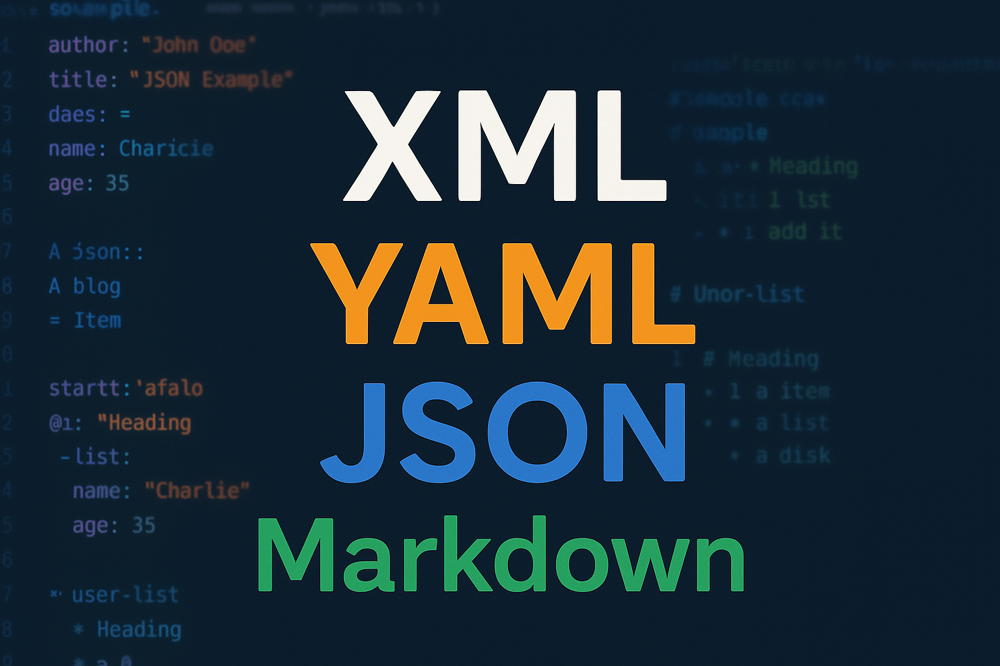

# 📚 Curso XML - Aprende Formatos de Datos Modernos

[](https://avl05.github.io/web-xml-alex/)
[](https://developer.mozilla.org/en-US/docs/Web/HTML)
[](https://developer.mozilla.org/en-US/docs/Web/CSS)
[](https://developer.mozilla.org/en-US/docs/Web/JavaScript)
[](https://getbootstrap.com/)



> 🌟 **Domina XML, JSON, YAML y Markdown** en 4 semanas con nuestro curso práctico y completo.

## 📖 Descripción

Curso completo y gratuito para aprender los formatos de datos más importantes en el desarrollo web moderno. Originalmente desarrollado como **trabajo colaborativo de 1º DAW**, ahora mejorado con un diseño profesional y contenido estructurado.

### ✨ ¿Qué aprenderás?

- **🔵 XML Completo**: Sintaxis, estructura, DTD, XML Schema, XPath y XSLT
- **🟢 JSON Moderno**: Sintaxis, JSON Schema, APIs RESTful, validación
- **🟡 YAML Práctico**: Configuraciones, Docker Compose, CI/CD workflows  
- **🟣 Markdown**: Documentación, GitHub Pages, herramientas

## 🚀 Características

- ⚡ **4 semanas estructuradas** de contenido
- 📚 **25+ lecciones** con teoría clara
- 💻 **10+ ejercicios** prácticos e interactivos
- 🎯 **Enfoque moderno** y profesional
- 📱 **Diseño responsive** optimizado para todos los dispositivos
- 🆓 **100% gratuito** y open source

## 🎯 Objetivo del Proyecto

El objetivo de este trabajo es enseñar de manera práctica y visual los formatos de datos esenciales:

- **XML**: Para intercambio de datos estructurados
- **JSON**: El estándar en APIs modernas
- **YAML**: Para configuraciones legibles
- **Markdown**: Para documentación universal

Cada formato se explica con teoría clara, ejemplos prácticos y ejercicios interactivos.

## 📚 Estructura del Curso

### 🗺️ Semana 1: Introducción a XML
- Historia y sintaxis básica
- Etiquetas e instrucciones de procesamiento  
- Declaraciones y estructura de documentos

### 🗺️ Semana 2: Documentos Válidos
- Validación de documentos XML
- DTD (Document Type Definition)
- Elaboración de documentos bien formados
- Espacios de nombres (namespaces)

### 🗺️ Semana 3: Validación Avanzada
- XPath para consultar documentos
- XSLT para transformaciones
- Creación de descripciones avanzadas
- Herramientas de validación

### 🗺️ Semana 4: Otros Formatos
- YAML: sintaxis y casos de uso
- JSON: APIs y estructuras de datos
- Markdown: documentación moderna

## 🔧 Tecnologías Utilizadas

- **HTML5** - Estructura semántica
- **CSS3** - Diseño moderno con gradientes y animaciones
- **JavaScript ES6+** - Interactividad y efectos
- **Bootstrap 5** - Framework responsive
- **GitHub Pages** - Hosting y despliegue

## 🌐 Demo en Vivo

👉 **[Ver Demo](https://avl05.github.io/web-xml-alex/)**

## 🚀 Instalación y Uso

### Para uso local:

1. **Clona el repositorio:**
   ```bash
   git clone https://github.com/AVL05/web-xml-alex.git
   cd web-xml-alex
   ```

2. **Abre en tu servidor local:**
   - Con VS Code: instala la extensión "Live Server"
   - Con Python: `python -m http.server 8000`
   - Con Node.js: `npx http-server`

3. **Navega a** `http://localhost:8000` (o el puerto que uses)

### Para GitHub Pages:

1. Fork este repositorio
2. Ve a Settings > Pages
3. Selecciona la rama `main` como fuente
4. Tu sitio estará disponible en `https://tu-usuario.github.io/web-xml-alex/`

## 📁 Estructura del Proyecto

```
web-xml-alex/
├── 📄 index.html              # Página principal
├── 📁 pages/                  # Páginas de contenido
│   ├── 📁 1_semana/          # Contenido semana 1
│   ├── 📁 2_semana/          # Contenido semana 2  
│   ├── 📁 3_semana/          # Contenido semana 3
│   ├── 📁 4_semana/          # Contenido semana 4
│   └── 📄 formulario.html    # Página de equipo
├── 📁 assets/                # Recursos estáticos
│   ├── 📁 css/              # Hojas de estilo
│   ├── 📁 js/               # JavaScript
│   └── 📁 img/              # Imágenes
├── 📁 content/              # Contenido educativo en Markdown
│   ├── 📁 Teoría (Markdown)/
│   └── 📁 Ejercicios (Markdown)/
└── 📄 README.md             # Este archivo
```

## 👥 Autor

**Alex Vicente López**
- GitHub: [@AVL05](https://github.com/AVL05)
- Email: alexviclop@gmail.com
- Ubicación: Torrent, Valencia, España

## 🙏 Agradecimientos

- **W3C** por las especificaciones de XML
- **MDN Web Docs** por la documentación excelente
- **Bootstrap** por el framework CSS
- **GitHub Pages** por el hosting gratuito
- **Compañeros de 1º DAW** por el trabajo colaborativo inicial

---

⭐ **¡Dale una estrella si este proyecto te ha ayudado!** ⭐
